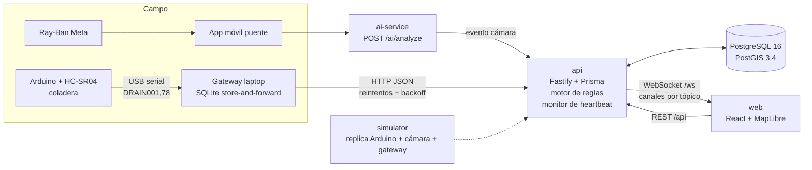

# Arquitectura

## Vista general

En Docker, `web` es nginx: sirve el SPA y hace proxy de `/api/*` y `/ws` hacia `api:3000`. El navegador habla con un solo origen: no hay CORS ni URL de API incrustada en el build.

## Servicios

| Servicio     | Tecnología                                    | Puerto         | Responsabilidad                                   |
| ------------ | --------------------------------------------- | -------------- | ------------------------------------------------- |
| `postgres`   | postgis/postgis:16-3.4                        | 5432           | Persistencia y consultas espaciales               |
| `api`        | Node 20, Fastify 5, Prisma 5, Zod             | 3000           | REST, WebSocket, auth, motor de reglas, heartbeat |
| `web`        | React 18, Vite, Tailwind 4, MapLibre (Fase 6) | 80 → host 5173 | Centro de control                                 |
| `simulator`  | Node 20, Fastify, SQLite (Fase 4)             | 4000 interno   | Coladeras, cámaras, gateway, modo sin Internet    |
| `ai-service` | Python 3.12, FastAPI                          | 8000 interno   | Análisis de imagen (mock), perfil `ai`            |

## Decisiones y trade-offs

**npm workspaces en lugar de pnpm.** Viene con Node, no requiere instalar nada adicional en las laptops del equipo y el monorepo es pequeño (5 paquetes). pnpm ahorraría disco, pero añade un paso de instalación y symlinks estrictos que complican los Dockerfiles.

**Fastify en lugar de Express.** Validación y serialización por esquema, logger estructurado (pino) con redacción de campos sensibles, y mejor rendimiento para ráfagas de lecturas de sensores.

**Columnas `geom` generadas por PostGIS.** Cada tabla con punto guarda `latitude`/`longitude` y una columna `geom` `GENERATED ALWAYS AS (ST_SetSRID(ST_MakePoint(lng, lat), 4326)) STORED`. Prisma escribe solo lat/lng y la geometría nunca se desincroniza. Costo: Prisma no conoce estas columnas ni sus índices GIST, así que la migración inicial es SQL escrito a mano. Las nuevas migraciones se generan con `--create-only` y se revisan antes de aplicarse (ver [desarrollo.md](desarrollo.md)).

**Seed idempotente en cada arranque.** La API ejecuta `migrate deploy` → `db seed` → servidor. El seed solo crea lo que falta, con UUID deterministas. Reiniciar contenedores no duplica datos ni pisa el estado operativo.

**Idempotencia de lecturas.** `sensor_readings` tiene un índice único en `(device_id, recorded_at)`. Cuando el gateway reintenta un lote que el servidor sí recibió, el reenvío no duplica filas. Así se cumple "sincroniza sin perder datos" sin duplicar.

**`compose.yaml` en la raíz.** La especificación ubica el compose en `docker/`, pero pide `docker compose up` desde la raíz. `compose.yaml` usa `include` para cumplir ambas cosas. Requiere Docker Compose 2.20 o superior.

**Imágenes de un solo stage para Node.** Se instalan todas las dependencias del workspace en cada imagen. Es más simple y reproducible sin lockfile, a costa de imágenes más pesadas. Se optimizará cuando exista `package-lock.json` versionado.

**Privacidad por diseño.** El servicio de IA solo reporta clases de infraestructura urbana. Nunca devuelve personas, rostros ni placas, y no persiste imágenes. Los logs redactan `authorization`, cookies, tokens y contraseñas.

**Autenticación.** El access token es un JWT HS256 que dura 15 min y no consulta la base en cada request. El refresh token es un JWT con `jti` que apunta a una fila de `refresh_tokens`. Cada uso lo rota. Si llega un refresh ya rotado, se asume robo y se revocan todas las sesiones del usuario. En el navegador viaja en una cookie httpOnly SameSite=Strict, fuera del alcance de JavaScript. Los dispositivos no tienen usuario: se autentican con una clave compartida (`x-device-key`) limitada a heartbeats y lecturas.

**WebSocket en proceso.** `WsHub` mantiene las suscripciones en memoria y los servicios publican con `hub.publish(canal, evento, datos)`. Alcanza para una sola instancia de la API. Para escalar horizontalmente basta con poner Redis o `LISTEN/NOTIFY` de Postgres detrás de `publish`, sin tocar a los clientes.

**Concurrencia en incidencias.** Las transiciones usan un `UPDATE … WHERE status = <estado leído>`. Si dos personas actúan a la vez sobre la misma incidencia, solo una gana y la otra recibe 409, sin bloqueos explícitos.

**Filtro bbox sin SQL crudo.** Para puntos, un rango de latitud y longitud equivale exactamente a `ST_MakeEnvelope`, así que se resuelve con Prisma. PostGIS se reserva para distancias reales (`ST_DWithin` sobre `geography`) y para leer geometrías.

**Motor de reglas puro más adaptador.** `domain/rules-engine.ts` evalúa las reglas contra un _resolver_ de hechos y no conoce la base de datos. `services/rules-engine.ts` resuelve los hechos con Prisma y PostGIS y aplica la acción. Así la lógica de reglas se prueba con hechos falsos, y el acceso a datos se prueba con los escenarios reales de la demo.

**Una incidencia por coladera que escala.** El motor no crea una incidencia por regla. Mantiene una sola incidencia activa por coladera y la escala: ALERTA, luego RIESGO ALTO, luego RIESGO CRÍTICO. Así el operador ve un solo caso con su historia completa en la bitácora, y no tres alertas sueltas. Nunca baja la prioridad automáticamente.

**Bloqueo por coladera.** Dos lecturas simultáneas de la misma coladera podrían crear dos incidencias. Cada evaluación toma `pg_advisory_xact_lock(hashtext(device_id))` dentro de su transacción. Las evaluaciones de coladeras distintas no se bloquean entre sí.

**Monitor de heartbeats en la API.** Es un `setInterval` en el proceso de la API, que no se superpone consigo mismo. Su `UPDATE` vuelve a comprobar el corte, así que un heartbeat que llega durante el barrido gana. Con varias instancias de la API bastaría con que una sola lo ejecute, o con un lock de Postgres.

**Simulador como gateway real.** El simulador sigue el mismo camino que el hardware. Genera la línea serial del Arduino (`DRAIN001,78`), la convierte con el mismo parser (`serialLineToDrainReading`) y escribe primero en SQLite. Ningún emisor habla con la red: solo el `SyncWorker` lo hace. Así, cambiar el simulador por el gateway real es cambiar la fuente de las lecturas, no la lógica de envío.

**Outbox en SQLite (better-sqlite3).** Es síncrono y transaccional, usa WAL para que escribir no bloquee al worker y sobrevive a reinicios. Los rechazos definitivos de la API van a una "dead letter" y no bloquean la cola. Un 400 sobre un lote hace que se reintente elemento por elemento, para aislar el evento inválido. Las filas sincronizadas se purgan después de una hora.

**Panel del simulador detrás del proxy.** El simulador no publica puerto, como pide la especificación. Su panel se sirve en `/simulator/` desde nginx o Vite, en el mismo origen que la web.

**Frontend.** Usa React 18, React Router, TanStack Query para datos del servidor y Zustand para el estado de sesión, conexión y feed en vivo.

- **Sesión.** El access token vive solo en memoria y el refresh viaja en una cookie httpOnly. Al recargar, `RequireAuth` restaura la sesión con `POST /auth/refresh`. Un 401 dispara un único refresh compartido: dos refresh simultáneos activarían la detección de reutilización.
- **Tiempo real.** Hay un solo WebSocket (`LiveSocket`) que se reconecta con backoff y pide un token nuevo al reconectar. Cada mensaje actualiza la caché de TanStack Query en sitio (`applyLiveMessage`), así que métricas, tablas y medidores cambian sin recargar ni volver a consultar. El feed inferior omite heartbeats y lecturas rutinarias: solo muestra cambios de estado.
- **Conectividad.** El cliente distingue "sin red", cuando `navigator.onLine` es falso, de "servidor caído", cuando `fetch` falla o el proxy responde 5xx sin sobre de error. En ambos casos TanStack Query conserva los últimos datos y un banner lo indica.
- **Series para sparklines.** `GET /drains/:code/readings/series` agrega en Postgres con `date_bin`: 48 puntos por día en lugar de unas 17 000 lecturas crudas.

**Mapa.** Usa MapLibre GL 5 con tiles vectoriales de OpenFreeMap: esquema OpenMapTiles, gratis y sin API key.

- **Estilo propio.** El mapa base es oscuro y está escrito a mano en `features/map/style.ts`, para que coincida con los tokens de la interfaz y la ciudad quede detrás de los datos. Los edificios usan `fill-extrusion` con `render_height` desde zoom 14. El botón 2D/3D cambia la inclinación y aplana los edificios.
- **Marcadores.** Son SVG propios registrados como imágenes: un círculo de color por estado con un glifo blanco encima. Las incidencias usan rombos por prioridad para no confundirse con dispositivos.
- **Capas.** Las 12 capas conmutables son grupos de capas MapLibre sobre cinco fuentes GeoJSON: dispositivos, incidencias, accesibilidad, rutas y zonas de inundación. Mostrar u ocultar una capa cambia `visibility`: no vuelve a crear capas ni a descargar datos.
- **Tiempo real.** Las fuentes se alimentan de la misma caché de TanStack Query que parchea el WebSocket. Cuando cambia el nivel de una coladera, `setData` actualiza el marcador, su etiqueta y su halo sin recargar.
- **Popups.** Muestran los datos crudos con timestamp y edad relativa, escapados contra XSS.
- **Ciudadanía.** Las capas de dispositivos se ocultan para la ciudadanía, porque la API no le entrega esos datos.
- **Nota de CSS.** `maplibre-gl.css` fuerza `position: relative` en el contenedor, así que este necesita tamaño explícito (`h-full`) y la fila de la grilla debe ser definida.

**Rutas accesibles.**

- **Red peatonal.** La red viene de OpenStreetMap. `scripts/build-pedestrian-network.mjs` la descarga una sola vez con la API Overpass, la parte en intersecciones y la guarda en `database/gis`. La API nunca llama a Overpass en tiempo de ejecución. Datos © colaboradores de OpenStreetMap, licencia ODbL.
- **Coordenadas del seed.** Los dispositivos, puntos de accesibilidad, incidencias y rutas del seed están en esquinas reales de esa misma red. Así las rampas coinciden con los cruces que el router evalúa.
- **Código puro y reglas.** `domain/pedestrian-graph.ts` contiene el grafo y el A\*, sin base de datos. `services/accessible-routing.ts` convierte puntos de accesibilidad e incidencias activas en costos y bloqueos: rampas, escaleras, obstáculos y banquetas dañadas.
- **Por qué A\* en Node y no pgRouting.** La red es pequeña, unas 7 000 intersecciones, y el cálculo tarda milisegundos. Además, la imagen `postgis/postgis` no trae pgRouting.
- **Recalculo automático.** En la web, la consulta de la ruta vive bajo la clave `incidents`. Cualquier incidencia nueva que llega por WebSocket la invalida, así que una ruta bloqueada se recalcula sola y muestra la alternativa.

## Tolerancia a fallos (resumen)

| Falla                          | Comportamiento                                                         | Fase  |
| ------------------------------ | ---------------------------------------------------------------------- | ----- |
| Gateway sin Internet           | Guarda en SQLite con `synced=false`; reintenta con backoff exponencial | 4     |
| API caída                      | Igual que arriba; el frontend muestra "Servidor no disponible"         | 4, 10 |
| Navegador sin red              | Banner "Sin conexión — mostrando últimos datos"                        | 10    |
| Dispositivo sin heartbeat 90 s | `devices.status = offline` y evento `devices:status`                   | 3     |

Detalles del frontend (Fase 10):

- **Dos banners distintos.** "Sin conexión" aparece cuando el navegador pierde la red. "Servidor no disponible" aparece cuando hay red pero la API no responde. Los dos indican la antigüedad de los datos mostrados ("actualizados hace 2 min").
- **Sin reintentos inútiles.** Si la API no responde, las consultas fallan de inmediato y cada vista muestra su línea de error con "Reintentar". El banner consulta `/health` cada 5 s y, cuando la API vuelve, recarga todas las consultas.
- **Error boundary por vista.** Si una vista falla al renderizar, se muestra un aviso en su lugar. La barra superior, la navegación y el timeline siguen funcionando, y al cambiar de vista el error se limpia.
- **Teclado.** Las filas clicables (incidencias, reglas) se enfocan con Tab y se abren con Enter o Espacio.
- **Pantallas angostas.** Por debajo de 1280 px el mapa oculta el panel lateral de incidencias para conservar el ancho del mapa.

## Plan de fases

| Fase | Alcance                                                          | Estado |
| ---- | ---------------------------------------------------------------- | ------ |
| 1    | Monorepo, Docker Compose, PostGIS, Prisma, esquema, seeds        | Hecha  |
| 2    | Auth JWT, roles, CRUD devices/incidents/accessibility, WebSocket | Hecha  |
| 3    | Motor de reglas, ingesta, heartbeat monitor                      | Hecha  |
| 4    | Simulador con SQLite store-and-forward y panel de control        | Hecha  |
| 5    | Frontend: layout, login, dashboard                               | Hecha  |
| 6    | Mapa MapLibre + edificios 3D + 12 capas                          | Hecha  |
| 7    | Panel de incidencias + timeline en vivo                          | Hecha  |
| 8    | Accesibilidad: rutas y alternativas                              | Hecha  |
| 9    | Mantenimiento, reglas, usuarios, logs                            | Hecha  |
| 10   | Pulido visual, estados de error, offline                         | Hecha  |
| 11   | E2E Playwright de los 6 escenarios + documentación final         | Hecha  |
